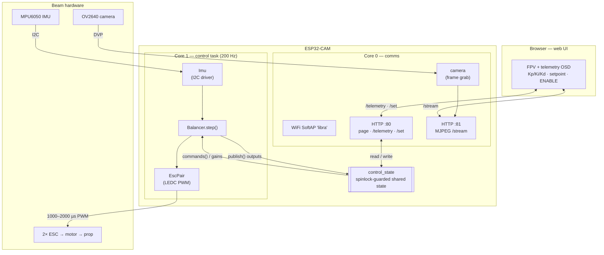
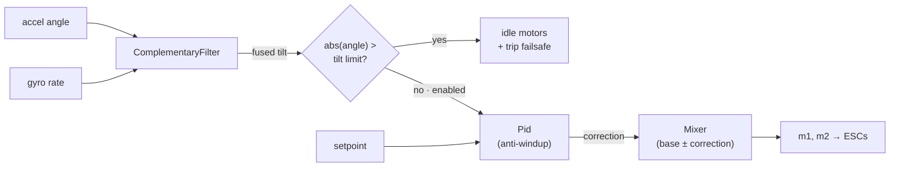

# Libra

<p align="center">
  
</p>

A self-balancing **beam** for hands-on PID experimentation.

A weighing-scale–style beam pivots at its center, with a brushless motor +
propeller at each end. Differential propeller thrust rotates the beam; an
MPU6050 measures the beam's tilt; a PID loop running on an **ESP32-CAM** drives
the two ESCs to hold a target angle (level by default). It's a single rotational
axis — the simplest interesting plant for learning to tune P, I, and D.

The MCU sits at the pivot, so its camera looks out along the beam: the web UI
shows a live FPV stream with the telemetry drawn over it as an OSD overlay.

## Hardware

| Part | Notes |
|---|---|
| ESP32-CAM (AI-Thinker) | Controller + camera. Dual-core: PID on one core, camera/web on the other. |
| MPU6050 | 6-axis IMU, I2C. Mounted on the beam to read tilt. |
| 2× brushless motor + ESC | Standard 1000–2000 µs servo-PWM ESCs. |
| 2× propeller | One per beam end, providing the balancing thrust. |
| USB-TTL / FTDI adapter | For flashing + serial (the ESP32-CAM has no USB). |

Pins are defined in `src/config.h`. Defaults (the SD-card pins, free when no
microSD is used — verify against your module): I2C `SDA=GPIO14`, `SCL=GPIO15`;
ESC signals on `GPIO13` and `GPIO12`. Do **not** use `GPIO0` (camera clock +
boot strap) or `GPIO4` (flash LED).

### Flashing

The ESP32-CAM flashes over the FTDI adapter: wire `U0T/U0R`, `5V`, `GND`, then
tie `GPIO0 → GND` and tap reset to enter the bootloader before `mise run upload`.
Remove the `GPIO0` jumper and reset to run the firmware.

> ⚠️ **Props spin.** Bench-test with propellers removed or the beam clamped.
> The firmware boots **disarmed** and cuts thrust if the beam exceeds a tilt
> limit — keep it that way until you trust your gains.

## Architecture

The ESP32-CAM is dual-core. **Core 1** runs the fixed-rate control loop and
nothing else; **core 0** runs WiFi, the web servers, and the camera. They never
touch each other's objects — the single contact point is `control_state`
(`src/control_state.*`), a spinlock-guarded struct the control task publishes
into and the web layer reads/writes. So a busy stream or a dropped browser can
never stall balancing.



The control policy itself lives in `Balancer.step()` (`lib/balancer/`): fuse the
tilt estimate, trip the failsafe past the limit, otherwise run PID into the
mixer. Disabled or tripped, the motors idle; each re-arm resets the integrator so
stale wind-up can't kick.



Two details worth knowing:

- **Host/hardware split.** The blocks in the second diagram —
  `lib/{filter,pid,mixer,balancer}` — are pure C++ with no Arduino deps, so the
  whole control policy is unit-tested on the host (`mise run test`).
  `Imu`/`EscPair`/`camera`/`web` are Arduino-only hardware drivers.
- **LEDC timer split.** The camera's XCLK and ESP32Servo both use LEDC.
  `cameraInit()` claims timer 0 *before* `escs.begin()` grabs timers 2 & 3 — see
  the `setup()` ordering in `src/main.cpp`. Reordering them breaks the camera.

## Toolchain

Everything runs through [mise](https://mise.jdx.dev/), which loads `.env` and
manages the Python venv holding PlatformIO. **Always use the mise tasks** so the
environment is set up correctly.

```sh
mise run setup     # one-time: create .env + venv, install PlatformIO
mise run build     # compile firmware for the ESP32-CAM
mise run upload    # build + flash over the FTDI adapter
mise run monitor   # open the serial monitor (115200 baud)
mise run run       # build + upload + monitor
mise run test      # host-side unit tests (pid / filter / mixer / balancer)
mise run format    # clang-format src/ lib/ test/
```

## Configuration

Build-time settings come from **`.env`** (gitignored — `mise run setup` copies
`.env.example`). mise loads `.env` and PlatformIO injects each value as a `-D`
build flag; the defaults in `src/config.h` apply when a variable is unset.
**Edit `.env`, then rebuild** (`mise run build` / `upload`) to apply.

| Variable | Default | Purpose |
|---|---|---|
| `LIBRA_THROTTLE_MAX` | `0.05` | Hard per-motor throttle ceiling (0..1). 5% is a safe bench default; raise once you trust your gains. |
| `LIBRA_AP_SSID` | `libra` | Name of the WiFi AP the board hosts. |
| `LIBRA_AP_PASSWORD` | `balancebot` | AP password (≥ 8 chars, or empty for an open network). |

**Convention:** name new knobs `LIBRA_<AREA>_<NAME>`, document them in
`.env.example` with their default, and back each with an `#ifndef` default in
`src/config.h` (see [CLAUDE.md](CLAUDE.md) for the full pattern).

## Using the web UI

The board hosts its own WiFi access point (no router needed). Credentials are
set in `.env` (`LIBRA_AP_SSID` / `LIBRA_AP_PASSWORD`) — defaults below:

1. Connect to WiFi **`libra`** (password `balancebot`).
2. Open **`http://192.168.4.1/`**.
3. You'll see the live camera FPV with a telemetry OSD (tilt, output, motor
   bars, an angle plot). Tap **⚙ tune** for the Kp/Ki/Kd/setpoint sliders and
   the **ENABLE** button. Gains apply live — no reflash.

The control loop runs on core 1 and never blocks on the network, so balancing
keeps going even if the browser disconnects. It still boots **disarmed**; you
must press ENABLE (or send `e` over serial).

## Status

Built incrementally; see the milestones in the project plan:

- **M0** — toolchain + docs: builds, flashes, prints a boot banner.
- **M1** — IMU angle readout (complementary filter).
- **M2** — ESC bring-up + arming.
- **M3** — closed PID loop with tilt failsafe.
- **M4** — WiFi web UI: camera FPV stream + OSD overlay, live gain tuning + telemetry.

Web UI assets in `assets/` are embedded into the firmware as PROGMEM arrays by
`mise run hexdump` (run automatically before `build`); the firmware `#include`s
the generated `assets/*.h` and serves them — no filesystem needed.
