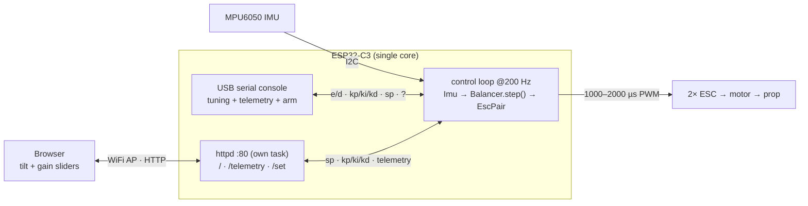
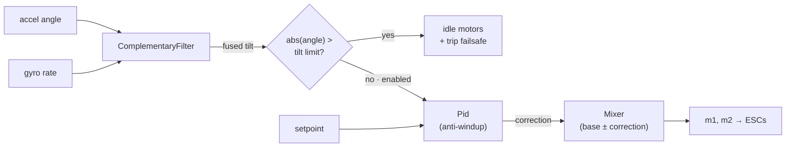

# Libra

<p align="center">
  
</p>

A self-balancing **beam** for hands-on PID experimentation.

A weighing-scale–style beam pivots at its center, with a brushless motor +
propeller at each end. Differential propeller thrust rotates the beam; an
MPU6050 measures the beam's tilt; a PID loop running on an **ESP32-C3 Super
Mini** drives the two ESCs to hold a target angle (level by default). It's a
single rotational axis — the simplest interesting plant for learning to tune P,
I, and D. Tuning and telemetry are over the USB serial console, or over an
optional WiFi web UI (target tilt + PID gains). Arming stays serial-only.

## Hardware

| Part | Notes |
|---|---|
| ESP32-C3 Super Mini | Controller. Single-core RISC-V with native USB. |
| MPU6050 | 6-axis IMU, I2C. Mounted on the beam to read tilt. |
| 2× brushless motor + ESC | Standard 1000–2000 µs servo-PWM ESCs. |
| 2× propeller | One per beam end, providing the balancing thrust. |

Pins are defined in `src/config.h` and overridable via `.env` (see
[Configuration](#configuration)). Defaults (verify against your board's
silkscreen): I2C `SDA=GPIO2`, `SCL=GPIO3`; ESC signals on `GPIO0` and `GPIO1`.
`GPIO2` is a strapping pin used for SDA — fine because I2C idles high; keep the
other strapping pins (`GPIO8`/`GPIO9`) and the native-USB pins (`GPIO18`/`GPIO19`)
free.

### Flashing

The C3 Super Mini has native USB — just plug it in and run `mise run upload`. If
the upload can't connect, enter download mode once: hold **BOOT**, tap **RST**,
release BOOT, then upload (the USB-CDC auto-reset handles it after that).

> ⚠️ **Props spin.** Bench-test with propellers removed or the beam clamped.
> The firmware boots **disarmed** and cuts thrust if the beam exceeds a tilt
> limit — keep it that way until you trust your gains.

## Architecture

The C3 is single-core: one fixed-rate loop reads the IMU, runs the control
policy, and drives the ESCs, while polling the USB serial console for tuning
commands between steps. Serial I/O is non-blocking, so it never stalls the loop.
The optional web UI runs as an HTTP server (ESP-IDF `httpd`) in its own task; it
only exchanges the setpoint, gains, and telemetry with the loop — it never arms
the motors. The loop measures `dt` each step, so it tolerates the WiFi stack's
timing jitter on the shared core.



The control policy lives in `Balancer.step()` (`lib/balancer/`): fuse the tilt
estimate, trip the failsafe past the limit, otherwise run PID into the mixer.
Disabled or tripped, the motors idle; each re-arm resets the integrator so stale
wind-up can't kick.



**Host/hardware split.** `lib/{filter,pid,mixer,balancer}` are pure C++ with no
Arduino deps, so the whole control policy is unit-tested on the host
(`mise run test`). `Imu` and `EscPair` are Arduino-only hardware drivers.

## Toolchain

Everything runs through [mise](https://mise.jdx.dev/), which loads `.env` and
manages the Python venv holding PlatformIO. **Always use the mise tasks** so the
environment is set up correctly.

```sh
mise run setup     # one-time: create .env + venv, install PlatformIO
mise run build     # compile firmware for the ESP32-C3
mise run upload    # build + flash over USB
mise run monitor   # open the serial monitor (115200 baud)
mise run run       # build + upload + monitor
mise run test      # host-side unit tests (pid / filter / mixer / balancer)
mise run format    # clang-format src/ lib/ test/
mise run probe     # ask the board its state over serial ('?')
mise run banner    # reset + capture the boot banner
mise run stream    # capture serial output (e.g. the debug IMU stream)
```

**Testing & debugging** — host tests, flashing, talking to the board, the debug
log level, and IMU bring-up are covered in **[docs/testing.md](docs/testing.md)**.

## Configuration

Build-time settings come from **`.env`** (gitignored — `mise run setup` copies
`.env.example`). mise loads `.env` and PlatformIO injects each value as a `-D`
build flag; the defaults in `src/config.h` apply when a variable is unset.
**Edit `.env`, then rebuild** (`mise run build` / `upload`) to apply.

| Variable | Default | Purpose |
|---|---|---|
| `LIBRA_THROTTLE_MAX` | `0.05` | Hard per-motor throttle ceiling (0..1). 5% is a safe bench default; raise once you trust your gains. |
| `LIBRA_TILT_LIMIT_DEG` | `45.0` | Tilt failsafe — past this many degrees the motors cut and latch disabled. |
| `LIBRA_ANGLE_OFFSET_DEG` | `0.0` | Tilt zero-offset (deg), subtracted so a physically level beam reads 0. |
| `LIBRA_I2C_SDA` / `LIBRA_I2C_SCL` | `2` / `3` | MPU6050 I2C pins (GPIO). |
| `LIBRA_ESC_PIN1` / `LIBRA_ESC_PIN2` | `0` / `1` | ESC signal pins (GPIO). |
| `LIBRA_AP_SSID` | `libra` | WiFi SoftAP name for the web UI. |
| `LIBRA_AP_PASSWORD` | `balancebot` | WiFi SoftAP password (WPA2 — must be 8–63 chars). |

**Convention:** name new knobs `LIBRA_<AREA>_<NAME>`, document them in
`.env.example` with their default, and back each with an `#ifndef` default in
`src/config.h` (see [CLAUDE.md](CLAUDE.md) for the full pattern).

## Tuning over serial

Open the serial monitor (`mise run monitor`, 115200 baud) and type commands:

| Command | Effect |
|---|---|
| `e` | enable (arm the control loop) |
| `d` / `x` | disable (`x` is the emergency-stop alias) |
| `kp <v>` / `ki <v>` / `kd <v>` | set a PID gain live |
| `sp <v>` | set the target tilt, degrees |
| `?` | print state (angle, output, motor throttles, gains) |

The firmware boots **disarmed** — nothing spins until you send `e`. Exceeding the
tilt limit cuts the motors and latches disabled until you re-enable. The setpoint
and gains (`sp`, `kp`, `ki`, `kd`) can also be set from the web UI below.

## Web control

On boot the board starts a WiFi access point and a small web UI for live tuning:

1. Join the WiFi network named by `LIBRA_AP_SSID` (default `libra`) using
   `LIBRA_AP_PASSWORD` (default `balancebot`).
2. Browse to **`http://192.168.4.1/`**.
3. Use the sliders to set the target tilt and the PID gains. The page shows live
   angle and arm/trip state; changes made over serial are reflected here too.

The web UI is **setpoint + gains only**. Arm/disarm stays on the serial console
(`e` / `d`), so a client on the AP can never spin up the props, and a web-set
target is clamped to the tilt limit. Set real AP credentials in `.env` before
running anywhere it matters — the defaults are public.

## Status

Built incrementally:

- **M0** — toolchain + docs: builds, flashes, prints a boot banner.
- **M1** — IMU angle readout (complementary filter).
- **M2** — ESC bring-up + arming.
- **M3** — closed PID loop with tilt failsafe + serial tuning.
