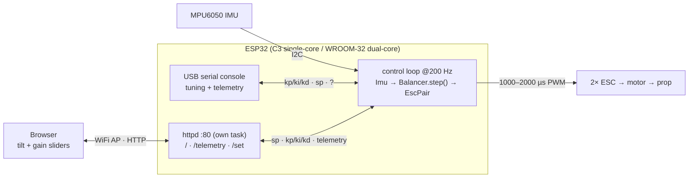
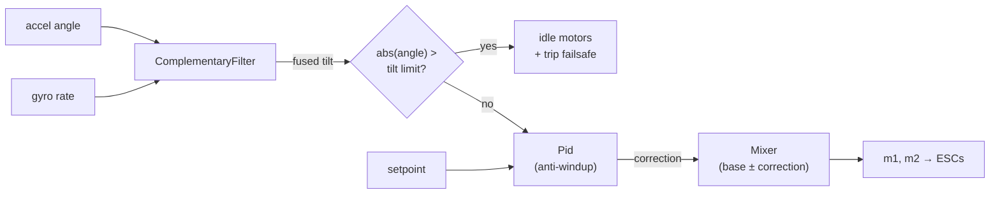

# Libra

<p align="center">
  
</p>

A self-balancing **beam** for hands-on PID experimentation.

A weighing-scale–style beam pivots at its center, with a brushless motor +
propeller at each end. Differential propeller thrust rotates the beam; an
MPU6050 measures the beam's tilt; a PID loop running on an **ESP32** (C3 Super
Mini or WROOM-32) drives the two ESCs to hold a target angle (level by default). It's a
single rotational axis — the simplest interesting plant for learning to tune P,
I, and D. Tuning and telemetry are over the USB serial console, or over an
optional WiFi web UI (target tilt + PID gains). Arming is a hardware switch on the
ESC supply — never software.

## Hardware

| Part | Notes |
|---|---|
| ESP32-C3 Super Mini *or* ESP32 WROOM-32 | Controller. C3 = single-core RISC-V + native USB; WROOM-32 = dual-core + USB-UART bridge. |
| MPU6050 | 6-axis IMU, I2C. Mounted on the beam to read tilt. |
| 2× brushless motor + ESC | Standard 1000–2000 µs servo-PWM ESCs. |
| 2× propeller | One per beam end, providing the balancing thrust. |

Pins are board-specific — literal `-D` flags per `[env]` in `platformio.ini`
(`src/config.h` defaults apply when unset). Verify against your board's silkscreen.
**C3 Super Mini:** I2C `SDA=GPIO2`, `SCL=GPIO3`; ESCs on `GPIO0`/`GPIO1` (`GPIO2` is
a strapping pin but fine for SDA — I2C idles high; keep `GPIO8`/`GPIO9` and USB
`GPIO18`/`GPIO19` free). **WROOM-32:** I2C `SDA=GPIO32`, `SCL=GPIO33`; ESCs on
`GPIO25`/`GPIO26` — all non-strapping (avoid the classic-ESP32 strapping pins
`GPIO0`/`GPIO2`/`GPIO12`/`GPIO15`).

### Flashing

The C3 Super Mini has native USB — just plug it in and run `mise run upload`. If
the upload can't connect, enter download mode once: hold **BOOT**, tap **RST**,
release BOOT, then upload (the USB-CDC auto-reset handles it after that).

> ⚠️ **Props spin.** Bench-test with propellers removed or the beam clamped.
> Arming is a hardware switch on the ESC supply — keep it **OFF** until you trust
> your gains. The firmware cuts thrust (and auto-resumes) around a tilt limit, but
> that failsafe is the *only* software guard now.

## Architecture

A dedicated, core-pinned control task reads the IMU, runs the control policy, and
drives the ESCs, sleeping to its period (`xTaskDelayUntil`) between steps and polling
the USB serial console non-blockingly so it never stalls. It's pinned to the APP core
(core 1 on the dual-core WROOM-32 — isolated from the WiFi stack on core 0; the only
core on the C3) at a priority above the web server but below WiFi, so control stays
responsive while WiFi is never starved. The optional web UI runs as an HTTP server
(ESP-IDF `httpd`) in its own task; it only exchanges the setpoint, gains, and telemetry
with the control task — it has no arming control (arming is a hardware switch on the
ESC supply). `dt` is measured each step, so it tolerates timing jitter.



The control policy lives in `Balancer.step()` (`lib/balancer/`): fuse the tilt
estimate, trip the failsafe past the limit, otherwise run PID into the mixer.
While tripped the motors idle; recovering within the limit resets the integrator so
stale wind-up can't kick on resume.



**Host/hardware split.** `lib/{filter,pid,mixer,balancer}` are pure C++ with no
Arduino deps, so the whole control policy is unit-tested on the host
(`mise run test`). `Imu` and `EscPair` are Arduino-only hardware drivers.

## Toolchain

Everything runs through [mise](https://mise.jdx.dev/), which loads `.env` and
manages the Python venv holding PlatformIO. **Always use the mise tasks** so the
environment is set up correctly.

```sh
mise run setup     # one-time: create .env + venv, install PlatformIO
mise run build     # compile firmware for the ESP32-C3
mise run upload    # build + flash over USB
mise run monitor   # open the serial monitor (115200 baud)
mise run run       # build + upload + monitor
mise run test      # host-side unit tests (pid / filter / mixer / balancer)
mise run format    # clang-format src/ lib/ test/
mise run probe     # ask the board its state over serial ('?')
mise run banner    # reset + capture the boot banner
mise run stream    # capture serial output (e.g. the debug IMU stream)
```

**Testing & debugging** — host tests, flashing, talking to the board, the debug
log level, and IMU bring-up are covered in **[docs/testing.md](docs/testing.md)**.

## Configuration

Deployment tunables come from **`.env`** (gitignored — `mise run setup` copies
`.env.example`); mise loads `.env` and PlatformIO injects each as a `-D` build flag,
with `src/config.h` defaults applying when unset. The board **pin map** is separate:
literal `-D` flags per `[env]` in `platformio.ini`, not `.env`. **Edit `.env` (or the
env's pins), then rebuild** (`mise run build` / `upload`) to apply.

| Variable | Default | Purpose |
|---|---|---|
| `LIBRA_THROTTLE_MAX` | `0.05` | Hard per-motor throttle ceiling (0..1). 5% is a safe bench default; raise once you trust your gains. |
| `LIBRA_TILT_LIMIT_DEG` | `45.0` | Tilt failsafe — past this many degrees the motors cut and latch disabled. |
| `LIBRA_ANGLE_OFFSET_DEG` | `0.0` | Tilt zero-offset (deg), subtracted so a physically level beam reads 0. |
| `LIBRA_AP_SSID` | `libra` | Open WiFi SoftAP name for the web UI. |

(Pin map is not here — it's board-specific `-D` flags in `platformio.ini`; see [Hardware](#hardware).)

**Convention:** name new **tunables** `LIBRA_<AREA>_<NAME>`, document them in
`.env.example` with their default, and back each with an `#ifndef` default in
`src/config.h`. Board pins are literal `-D` flags in `platformio.ini` per `[env]`,
not `.env` knobs (see [CLAUDE.md](CLAUDE.md) for the full pattern).

## Tuning over serial

Open the serial monitor (`mise run monitor`, 115200 baud) and type commands:

| Command | Effect |
|---|---|
| `kp <v>` / `ki <v>` / `kd <v>` | set a PID gain live |
| `sp <v>` | set the target tilt, degrees |
| `?` | print state (angle, output, motor throttles, gains) |

There is no serial arm/disarm: **arming is a hardware switch on the ESC supply**, so
the control loop always runs and the switch decides whether the motors get power.
Exceeding the tilt limit cuts the motors and auto-resumes once back within the limit.
The setpoint and gains (`sp`, `kp`, `ki`, `kd`) can also be set from the web UI below.

## Web control

On boot the board starts a WiFi access point and a small web UI for live tuning:

1. Join the WiFi network named by `LIBRA_AP_SSID` (default `libra`). It is **open**
   by default; set `LIBRA_AP_PASS` (≥ 8 chars) for a WPA2 password.
2. Browse to **`http://192.168.4.1/`**.
3. Use the sliders to set the target tilt and the PID gains. The page shows the live
   angle and the trip/bench state; changes made over serial are reflected here too.

The web UI is **setpoint + gains only** — it has no arming control at all (arming is
a hardware switch on the ESC supply), so a client on the AP can never spin up the
props, and a web-set target is clamped to the tilt limit. The AP is **open** by
default (the web UI can't arm) — rename it via `LIBRA_AP_SSID`, and don't run it in
an untrusted RF area.

## Status

Built incrementally:

- **M0** — toolchain + docs: builds, flashes, prints a boot banner.
- **M1** — IMU angle readout (complementary filter).
- **M2** — ESC bring-up + arming.
- **M3** — closed PID loop with tilt failsafe + serial tuning.
